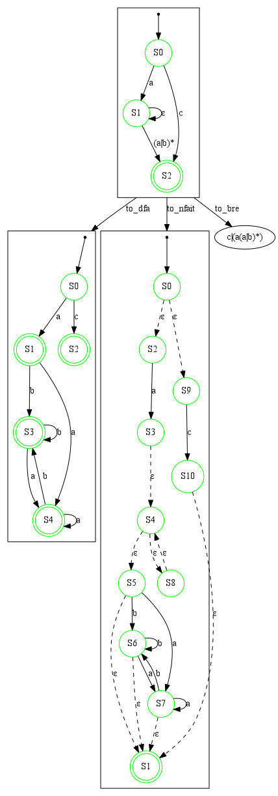
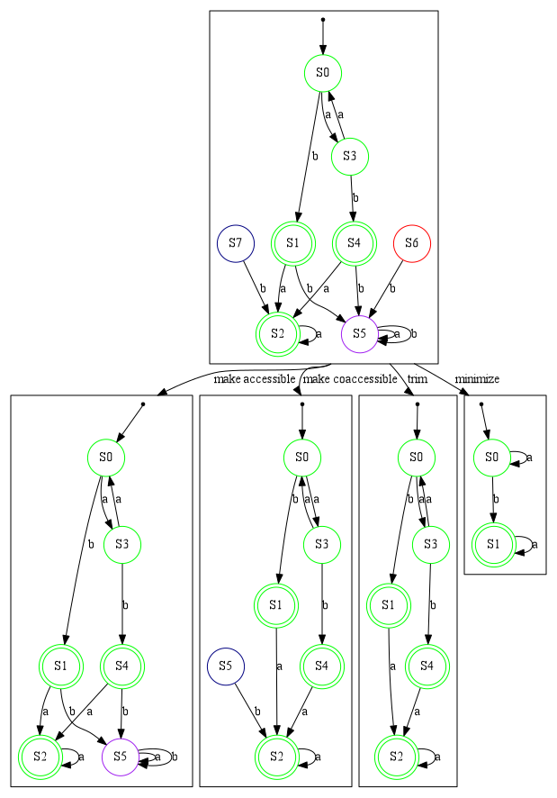

# AUTOmata Utilities and Representation (AUTOUR) 

The word "Autour" in French refers to a bird.
It corresponds to "Goshawk" in English.

Autour is a small toolbox to experiment with various kinds of automata and regular expressions.
This project is oriented towards pedagogy rather than performances.
It is still a work in progress.

## Formalisms

The automata formalisms are the following :
- Deterministic Finite Automata (DFA)
- Nondeterministic Finite Automata (NFA)
- Nondeterministic Finite Automata with Immediate Transitions (NFAIT) (i.e. with epsilon transitions)
- Generalized Nondeterministic Finite Automata (GNFA) with Basic Regular Expressions (BRE) labelling transitions (not yet entirely integrated)

We can also manipulate regular expressions :
- Basic Regular Expressions (BRE)
- Extended Regular Expressions (ERE) (not yet entirely integrated)

## Features

Automata can be drawn using GraphViz with the
[graphviz_dot_builder](https://crates.io/crates/graphviz_dot_builder) crate.

In the following we use those graphical representations to introduce some of the features of the toolbox.

### Translations

Translations between the different formalisms is possible.
In the example below we translate a GNFA into (from left to right) a DFA, a NFAIT and a BRE.

## (Co)-Accessibility and minimization

Various algorithms allow:
- determining if an automaton is accessible
- making it accessible
- determining if an automaton is coaccessible
- making it coaccessible
- determining if an automaton is coaccessible
- making it coaccessible
- minimizing an automaton

In the example below we have an initial DFA represented at the top of the image.
- The nodes in green are both accessible and coaccessible.
- Those in purple are accessible but not coaccessible.
- Those in blue are coaccessible but not accessible.
- Those in red are neither accessible nor coaccessible.

We then transform this initial DFA (from lef to right):
- by making it accessible
- by making it coaccessible
- by trimming it i.e. making it both accessible and coaccessible
- by minimizing it

 

### Alphabet hiding and substitution

Another thing that we can do is substitute letters or hide them.

In the example below we have an initial GNFA drawn at the top of the image.
Then, from left to right:
- we hide letter 'b' in it
- we substitute letter 'b' by letter 'c' in it

### Other features

Means to construct terms:
- union
- intersection
- concatenation
- repetition
- negation
- reversion

Others:
- completion up to alphabet
- running transitions and traces in DFA/NFA